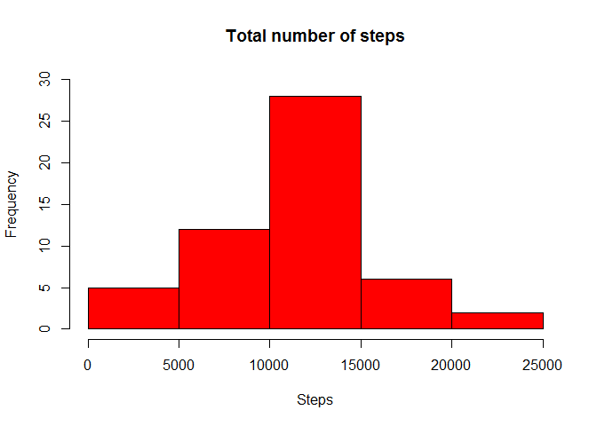
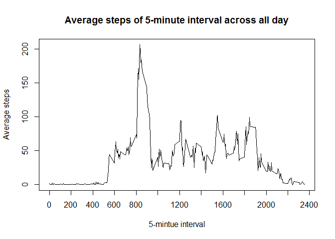
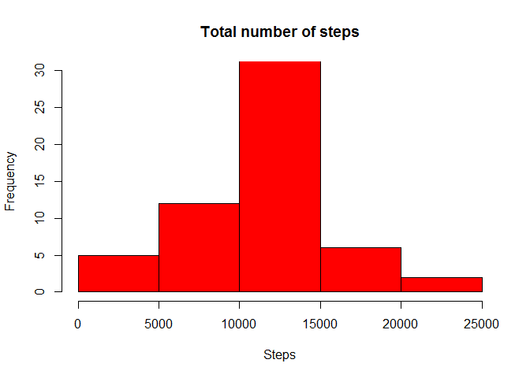

lz  
2018-11-03  

## Loading and preprocessing the data
1. Load the data
2. Transform the "date"" columns into date format

```r
activity <- read.csv('activity.csv', header = T)
activity$date <- as.Date(as.character(activity$date), '%Y-%m-%d')
```

## What is mean total number of steps taken per day?
1. Calculate the total number of steps taken per day
2. Make a histogram of the total number of steps taken each day

```r
library(dplyr)
daytotal <- activity %>% group_by(date) %>% summarise(total.steps = sum(steps)) 
hist(daytotal$total.steps, ylim = c(0,30), col = 'red',xlab = 'Steps', main = 'Total number of steps')
```

<!-- -->

3. Calculate the mean and median of the total number of steps taken per day.  
- According to the following results, the mean of the total number of steps taken per day is **10766.19**, and the median is **10765**.

```r
mean(daytotal$total.steps, na.rm = T)
```

```
## [1] 10766.19
```

```r
median(daytotal$total.steps, na.rm = T)
```

```
## [1] 10765
```

  
## What is the average daily activity pattern?
1. Make a time series plot of the 5-minute interval (x-axis) and the average number of steps taken, averaged across all days (y-axis)

```r
intervaldata <- activity %>% group_by(interval) %>% summarise(ave.steps = mean(steps, na.rm = T))
plot(intervaldata$interval, intervaldata$ave.steps, type = 'l',ann = F, xaxt = 'n')
title(main = 'Average steps of 5-minute interval across all day', 
      ylab = 'Average steps', xlab = '5-mintue interval')
axis(side = 1, at = seq(0,2400,200))
```

<!-- -->

2. Which 5-minute interval, on average across all the days in the dataset, contains the maximum number of steps?  
- According to the following result, the interval **"835"** contains the max number of steps.

```r
intervaldata$interval[which.max(intervaldata$ave.steps)]
```

```
## [1] 835
```

## Imputing missing values
1. Calculate the total number of missing values in the dataset
- The number of missing values in this dataset is 2304.

```r
sum(is.na(activity$steps))
```

```
## [1] 2304
```

2. Devise a strategy for filling in all of the missing values in the dataset. 
3. Create a new dataset with the missing data filled in.  
- The mean of corresponding 5-mintute interval is used to replace the missing values.

```r
fill.missing <- function(x) {
    if (is.na(x[1])) x[1] <- intervaldata$ave.steps[x[2] == intervaldata$interval] 
    x[1]
}
activity2 <- activity
activity2$steps <- apply(activity[,c('steps','interval')], 1, fill.missing)
```

4. Make a histogram of the total number of steps taken each day and Calculate the mean and median total number of steps taken per day. Do these values differ from the estimates from the first part of the assignment? What is the impact of imputing missing data on the estimates of the total daily number of steps?  
- The mean of the new dataset is **10766.19**. The median is **10766.19**. By using the mean of corresponding 5-mintute interval to replace NA values, the mean doesn't change and the median slightly increases.  


```r
daytotal2 <- activity2 %>% group_by(date) %>% summarise(total.steps = sum(steps)) 
hist(daytotal2$total.steps, ylim = c(0,30), col = 'red',xlab = 'Steps', main = 'Total number of steps')
```

<!-- -->

```r
mean(daytotal2$total.steps, na.rm = T)
```

```
## [1] 10766.19
```

```r
median(daytotal2$total.steps, na.rm = T)
```

```
## [1] 10766.19
```

## Are there differences in activity patterns between weekdays and weekends?
1. Create a new factor variable in the dataset with two levels - "weekday" and "weekend" indicating whether a given date is a weekday or weekend day.

```r
activity2$daytype <- ifelse(weekdays(activity2$date) %in% c('Saturday','Sunday'), 'weekend', 'weekday')
```
2. Make a panel plot containing a time series plot of the 5-minute interval (x-axis) and the average number of steps taken, averaged across all weekday days or weekend days (y-axis). 
- The pattern on weekdays and weekends are different. The weekday plot has a peak from interval 800 to 900, while the number of steps at weekend are more evenly distributed across interval 800 to 1600.

```r
intervaldata2 <- activity2 %>% group_by(interval, daytype) %>% summarise(ave.steps = mean(steps, na.rm = T))
library(lattice)
xyplot(ave.steps ~ interval | daytype, data = intervaldata2, type = 'l', layout = c(1,2),
       ylab = 'Number of steps', xlab = 'Interval')
```

<!-- -->


